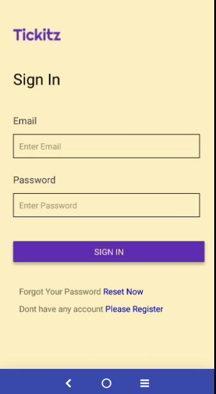
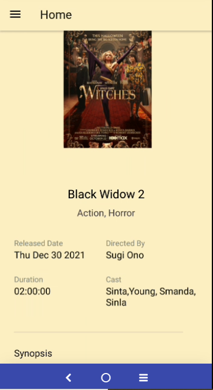
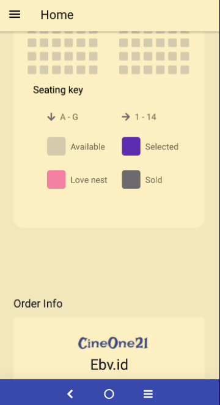

<div align="center">
<h1>Tickitz-Movies</h1>
  </div>
  
## Getting Started
  Tickitz-Movies is an application that can help you to order movies, Tickitz-Movies is very friendly UX and beutiful UI.

Link APLIKASI [https://drive.google.com/file/d/1P4xxwvN-xMMQMRYSN5ae82DpecCQNZI5/view?usp=sharing]

## Installation

If you want to use paytix you have to use nodejs version [12+](https://nodejs.org/dist/v16.13.1/node-v16.13.1-x64.msi)

Install the dependencies and devDependencies and start the server.

```sh
git clone this repository
cd repository
npm install
npx react-native link
npx react-native run-android
```

```sh
create file .env in root your project
BASE_URL=yourApiBaseUrl
```

## Build With

- [NodeJs] - Runtime Javascript environment for the backend
- [React Native] - UI Library for cross platform
- [Redux] - state management global
- etc.

## Demo

  
    
      
        
